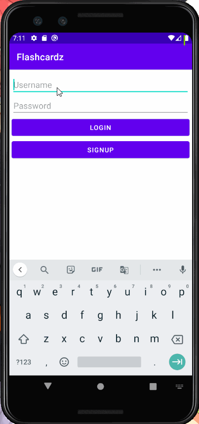
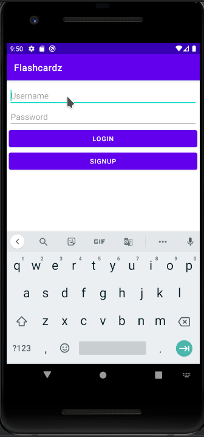

# Flashcardz

## Table of Contents
1. [Overview](#Overview)
1. [Product Spec](#Product-Spec)
1. [Wireframes](#Wireframes)
2. [Schema](#Schema)

## Overview
### Description
Flashcardz is a simple flashcards app to help you memorize any subject you need, as long as you can write them down. Create your own flashcards, save them to your account, and study them whenever you like.

### App Evaluation
- **Category**: Study Tool
- **Mobile**: Yes
- **Story**: Users can create flash cards by writing a term and definition each side of a flashcard. They can then 'flip' the card and view each side to reinforce their knowledge. They can also rank a card based on how difficult the card is so the system can show the card again.
- **Market**: Students have always been in need of ways to study, this app provides a simple user experience where they can get their studying done.
- **Habit**: Users can create as many sets of flash cards as they want and use them throughout the day to reinforce their learning.
- **Scope**: The app will start off with displaying a flash card's front and back and eventually expand to leaderboards and gamification.

## Product Spec

### 1. User Stories (Required and Optional)

**Required Must-have Stories**

- [x] User logs into the app, logout, and create account.
- [x] User can view and creates a new set of flashcards. 
- [x] User creates a flash card with a term and definition on the front and back of the card. 
- [ ] User can edit an existing card to change the term or definition.
- [ ] User can swipe left on a card to delete it from the set.
- [x] User can add as many cards as they want to a set. 
- [ ] User can swipe left on a set to delete it.
- [ ] User can tap on a card to flip it on the other side.  

**Optional Nice-to-have Stories**

- [ ] User can view the leaderboards of other players.
- [ ] User can run a game with a set of flashcards
- [ ] User can have fun using the app.
- [ ] User can add an image to the card. 

**Walkthroughs**

<br>


<br>
### 2. Screen Archetypes

* Log in screen
   * User can log into their account.
   * User can register new account
* Sets screen
   * User can view their sets of cards.
   * User can delete a set of cards.
   * User can add a set of cards.
* Flash cards screen
    * User can view their flash cards.
    * User can delete a flash card.
    * User can add a flash card.
    * User can flip a flash card.
    * User can add an image to a card. 
    * User can edit a card.
* Game screen
    * User can view the front or back of flash card.
    * User can advance through the next flash card (swiping)
    * User can rank a card on difficulty. 

### 3. Navigation

**Tab Navigation** (Tab to Screen)

* Profile 
* Stream
* Game

**Flow Navigation** (Screen to Screen)

* Login
   * Navigates to Sets screen
* Sets Screen
    * Navigates to Flash Cards screen
    * Navigates to Profile screen
* Flash Cards Screen
    * Navigates back to Home Screen
    * Navigates to Game Screen
* Game Screen
    * Navigates back to Flash Card screen
* Profile screen
    * Navigates to login screen (after logging out)

## Wireframes
Sets


Flash cards


Game


Profile


Flow


### [BONUS] Digital Wireframes & Mockups


### [BONUS] Interactive Prototype

## Schema
### Models

Flashcard
| Property  | Type | Description |
| -------- | -------- | -------- |
| frontSide | String | Front side of flashcard, default side, for terms, editable|
| backSide | String | Back side of card, editable |

FlashcardSet
| Property | Type | Description|
| -------- | -------- | -------- |
| setName | String | Set name | 
| listFlashcardset | List<Flashcard> | List of flash cards |
| author | User | The User object who made the set |

User
| Property | Type | Description |
| -------- | -------- | -------- |
| username | String | user's log in name |
| password | String | user's log in password | 
| listSets | List<FlashcardSet> | list of sets belonging to the user |


### Networking
- Home Sets Screen
    - (Read/GET) Query all sets of flashcards of the user
    ```
    let query = PFQuery(className:"FlashcardSet")
    query.whereKey("author", equalTo: currentUser)
    query.order(byAscending: "createdAt")
    query.findObjectsInBackground { (sets: [PFObject]?, error: Error?) in
        if let error = error { 
          print(error.localizedDescription)
       } else if let sets = sets {
          print("Successfully retrieved \(sets.count) sets.")
       }
    }
    ```
    - (Create/POST)Create New Set of Flashcards
    - (Delete) Delete existing set
- Flashcards Screen
    - (Read/GET) Query all flashcards of the set
    - (Create/POST) Create new Flashcard
    - (Delete) Delete existing flashcard
    - (Update/PUT) Update set of flashcards
    - (Update/PUT) Update flashcard
- Profile Screen
    - (Read/GET) Query logged in user object
